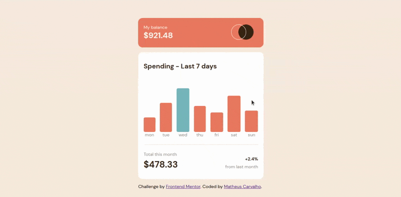
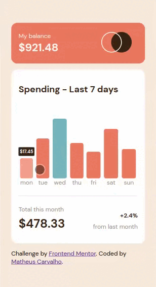

# Expenses Chart Component 
## 🖥 Sobre o projeto

_Expenses Chart Component_ é um projeto simples que consiste em um gráfico de despesas que utiliza dados estáticos para renderizar as informações de despesas referentes a uma semana. Essa é a minha solução para um desafio retirado do site [Frontend Mentor](https://www.frontendmentor.io/home). O projeto foi desenvolvido com o objetivo de colocar em prática conhecimentos em HTML, Sass, Typescript e [metodologia BEM](https://en.bem.info/methodology/).

### Demonstração do layout para desktops:

### Demonstração do layout para dispositivos mobile:

---
## 🛠️ Tecnologias
As seguintes tecnologias foram utilizadas na construção desse projeto:

---
## 📚 Referências 
- [TypeScript Documentation](https://www.typescriptlang.org/docs/)
- [Sass Documentation](https://sass-lang.com/documentation/)
- [BEM Quick start](https://en.bem.info/methodology/quick-start/)
- [Integrating TypeScript with Webpack](https://medium.com/jspoint/integrating-typescript-with-webpack-4534e840a02b)

---

## 📧 Contato

